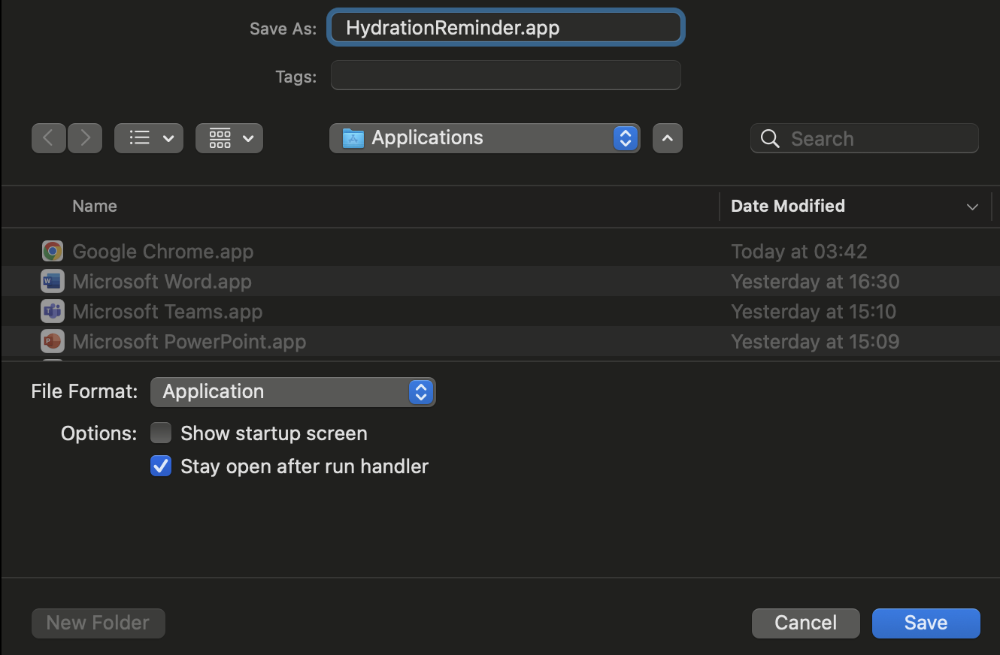

# 💧 HydrationReminder - Simple Water Reminder for macOS

A lightweight, reliable water reminder app for macOS built with pure AppleScript. Get gentle reminders to stay hydrated throughout your workday.


## ✨ Features

- 💧 **Automatic reminders every 30 minutes** during work hours (9 AM - 6 PM)
- 📱 **Native macOS integration**: Uses system notifications

## 🚀 Installation

### Step 1: Download and Open
1. **Download** `HydrationReminder.applescript` from this repository
2. **Open "Script Editor"** on your Mac (Applications → Utilities → Script Editor)
3. **Open the downloaded file** in Script Editor

### Step 2: Export as Application
1. In Script Editor, go to **File → Export...**
2. Choose these settings:
   - **File Format**: Application
   - **Name**: HydrationReminder.app
   - **Location**: `/Applications/` (or `~/Applications/`)
   - **✅ Check**: "Stay open after run handler" *(IMPORTANT!)*
   - **❌ Uncheck**: "Show startup screen"
3. Click **Save**

### Step 3: First Launch and Permissions
1. **Launch** `HydrationReminder.app` from Applications
2. **Allow notifications** when prompted by macOS:
   - Click "Allow" in the notification permission dialog
   - If you miss it, go to: System Preferences → Notifications & Focus → HydrationReminder → Allow Notifications
3. **Quit and relaunch** the app after granting permissions
4. **Success!** You should see a startup notification confirming the app is running

## 🎯 Usage

### Automatic Operation
- The app runs silently in the background
- Sends water reminders every 30 minutes during work hours (9 AM - 6 PM)
- If you don't interact with a notification within 5 minutes, you'll hear a gentle beep

## ⚙️ Customization

### Changing Work Hours
Edit these lines in the script:
```applescript
property startHour : 9  -- Start hour (9 AM)
property endHour : 18   -- End hour (6 PM)
```

### Changing Notification Frequency
```applescript
property notificationInterval : 1800  -- 1800 seconds = 30 minutes
```

### Changing Reminder Delay
```applescript
property reminderDelay : 300  -- 300 seconds = 5 minutes before beep
```

## 🔧 Troubleshooting

### App doesn't send notifications
1. **Check permissions**: System Preferences → Notifications & Focus → HydrationReminder

2. **Ensure "Stay open after run handler" was checked** during export
3. **Check the time**: App only works during configured hours (default: 9 AM - 6 PM)
4. **Relaunch the app** after changing permissions

### App stops working
1. **Check if app is still running**: Look for "HydrationReminder" in Activity Monitor
2. **Relaunch the app** if it's not running
3. **Check Console.app** for error messages (search for "Water Reminder")

### Notifications don't make sound
1. **Check system sound settings**: System Preferences → Sound → Sound Effects
2. **Check notification settings**: Make sure "Play sound for notifications" is enabled

## 🏗️ Technical Details

- **Language**: Pure AppleScript (no external dependencies)
- **Compatibility**: macOS Ventura (13.0) and later
- **Resource usage**: Very lightweight (< 10 MB memory)
- **Architecture**: Stay-open application with idle handlers

---

**💧 Stay hydrated, stay productive!**

*If this app helps you maintain healthy hydration habits, please consider giving it a ⭐ star!*
